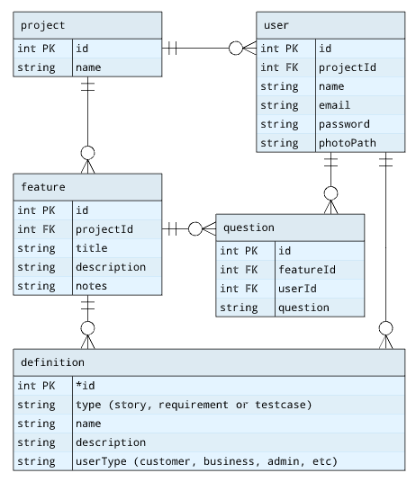

This is an API for managing project features. Internal and external user groups allow for collaboration and access control. Feature descriptions can have questions, user stories, requirements and test cases attached.

## Schema

## SQL
Run the docker compose file   
   
All accounts have the password "test"   
admin1@gmail.com - image stored at userImages/user1.jpg, project ID 1   
user1@client1.com - project ID 3   
user2@client1.com - project ID 3   
   
## Node app
Open the `/src/` folder    
Run `npm install`    
Install pm2 with `npm install -g pm2` (Run as admin)    
Run the node app with `pm2 start pm2.json`    
pm2 will watch for changes and restart, it will log everything to `src/logs/combined.log`    